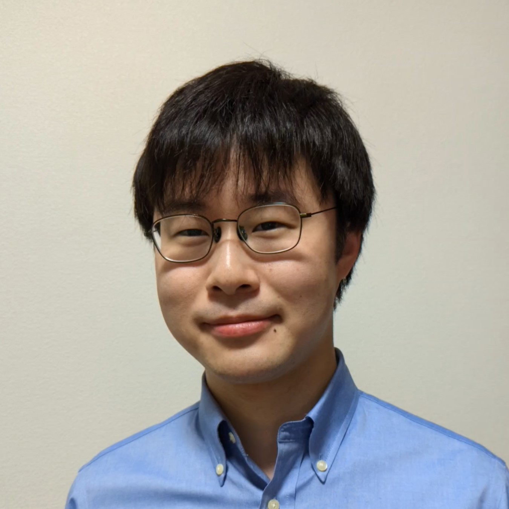

# ホーム

慶應義塾大学理工学部物理情報工学科

伏見グループ＠塚田研究室

生体磁気イメージング

―磁気で透かして触れずに描く、生体の構造・物性・機能―

## 教職員 {: data-subheading="STAFF" }

### 伏見 幹史 (Motofumi Fushimi)

慶應義塾大学 理工学部物理情報工学科 助教

博士（情報理工学）

- *🔗* [researchmap](https://researchmap.jp/motofumi-fushimi)

#### 学歴

- *2016.3* 東京大学 工学部計数工学科 卒業
- *2018.3* 東京大学 大学院情報理工学系研究科システム情報学専攻 修士課程 修了
- *2021.3* 東京大学 大学院情報理工学系研究科システム情報学専攻 博士課程 修了

#### 職歴

- *2018.4–2021.3* 日本学術振興会特別研究員 (DC1)
- *2019.4–2020.3* Visiting Graduate Assistant, Weill Medical College, Cornell University, NY, USA（日本学術振興会若手研究者海外挑戦プログラム）
- *2021.4–2025.3* 東京大学 大学院工学系研究科バイオエンジニアリング専攻 特任助教
- *2025.4–2026.3* 東京大学 大学院情報理工学系研究科システム情報学専攻 助教
- *2026.4–* 慶應義塾大学 理工学部物理情報工学科 助教

#### 所属学協会

- *🔗* [計測自動制御学会](https://www.ieice.org/jpn_r/)
- *🔗* [電気学会](https://www.iee.jp/)
- *🔗* [日本磁気学会](https://www.magnetics.jp/)
- *🔗* [日本生体磁気学会](https://square.umin.ac.jp/jbbs/)
- *🔗* [日本磁気共鳴医学会](https://www.jsmrm.jp/)
- *🔗* [Instutute of Electrical and Electronics Engineers (IEEE)](https://www.ieee.org/)
- *🔗* [International Society for Magnetic Resonance in Medicine (ISMRM)](https://www.ismrm.org/)

## ミッション＆ビジョン {: data-subheading="MISSION & VISION" }

### 医用イメージング・脳神経イメージング

高齢化が進む現代において、いかに健康寿命を延ばすかが社会の重要な課題です。体の中を可視化する医用イメージング技術による病気の早期診断が、患者を適切な治療に導くことにつながります。また、体の中でも心の座たる脳は特別な関心を集めます。脳神経イメージング技術による精神疾患や神経疾患の診断のほか、近年は工学応用も注目を集めています。

脳にせよそれ以外の部位にせよ、対象が人である以上、メスで切り開くことなく内部を可視化することが望まれます。磁気は音や光と異なり高い生体透過性を持ちながらも、エックス線やガンマ線と異なり被曝の心配もなく、生体のイメージングにとって魅力的な媒体です。

私たちの研究は、磁気測定に基づいて非侵襲に体内を可視化する医用イメージング・脳神経イメージング技術を通して、**心身の健康長寿社会の実現**に貢献することを目指しています。

### 非侵襲計測と逆問題

人体の非侵襲計測に代表されるように、対象に直接アプローチできないとき、周囲に広がる場を介して対象の情報を得ることになります。
このように場の時空間パターンの測定に基づいて発生源や媒質といった対象系の情報を復元する計測方式を、パターン計測、間接計測などと呼びます。

観測結果から因果律を遡ってその原因を推定する間接計測は、数理的には逆問題と呼ばれます。
逆問題は人体の非侵襲計測の他にも、構造物や建築物の非破壊検査、災害時の埋没者探索、地中や海底の資源探査など、広範にわたる応用を持つ工学の基礎的課題です。

私たちの研究では、所与の測定データから推定対象を復元する**逆問題の解法**に加え、推定対象を表現するモデルの構築や最適な測定系の設計、すなわち**逆問題の定式化**も研究対象として、非侵襲計測をはじめとする計測技術の開発に取り組んでいます。

## 新着情報 {: data-subheading="TOPICS" }

- *2025.06.20 📣* 国内会議 第40回日本生体磁気学会大会にて発表しました。
- *2025.05.14 📣* 国際会議 The 33rd ISMRM & ISMRT Annual Meeting & Exhibition にて "Multi-echo Bloch-Siegert shift method for simultaneous B1 magnitude and phase mapping" と題して発表しました。
- *2025.05.12 📝* 共著論文 "Performance evaluation of a a diamond quantum magnetometer for biomagnetic sensing: A phantom study" が出版されました。
- *2025.04.01 📝* 解説記事 「脳疾患治療のための磁気刺激」が出版されました。
- *2025.04.01 👥* 東京大学 大学院情報理工学系研究科システム情報学専攻 奈良・宮廻研究室に助教として着任しました。
- *2025.03.20 📣* 国内会議 電気学会全国大会にて「所望の磁気力場を生成する励磁コイルの最適設計法」と題して発表しました。
- *2024.11.20 📣* 国内会議 第29回計測自動制御学会パターン計測シンポジウムにて「脳磁図測定による神経活動源領域の推定―多重極モデルに基づくアプローチ―」と題して発表しました。
- *2024.09.26 🏆* The first MR Electrical Properties Tomography (MR-EPT) Reconstruction Challenge にて Podium in permittivity reconstruction を受賞しました。

## 研究 {: data-subheading="PROJECTS" }

### キーワード

医用画像、脳神経画像、生体磁気、パターン計測、間接計測、非侵襲計測、逆問題、磁気共鳴イメージング、脳磁図、経頭蓋磁気刺激

    <a href="projects#magnetic-resonance-imaging" class="card card-link">
        <h3>磁気共鳴イメージング</h3>
        
磁気共鳴現象に基づいて体内を画像化するMRIを用いて生体組織の物性値を画像化する研究に取り組んでいます。

    </a>
    <a href="projects#neuromagnetic-imaging" class="card card-link">
        <h3>磁気神経イメージング</h3>
        
脳内の神経活動に伴って漏れ出る磁気を測定する脳磁図(MEG)を用いて神経活動のマッピングに取り組んでいます。

    </a>
    <a href="projects#neuromagnetic-imaging" class="card card-link">
        <h3>経頭蓋磁気刺激</h3>
        
磁気刺激用コイルの設計に取り組んでいます。

    </a>

## 磁気共鳴イメージング {: data-subheading="MAGNETIC RESONANCE IMAGING" id="magnetic-resonance-imaging" }

### MRI測定に基づく定量的物性値イメージング

MRIで直接測定されるのは物性値ではなく、その影響を受けた磁場や変位場であり、逆問題解析によってこれら場の測定データから目的の物性値分布を画像再構成する必要があります。

私の研究では、各種物性値イメージング逆問題の支配方程式の共通性に着目し、電磁気特性や機械特性を再構成するための統一的な数理手法の構築に取り組んでいます。

### 電磁気特性イメージングのためのMRI撮像シーケンス

他の医用画像技術と比較したMRIの課題として、撮像時間が長いことがあげられます。

そこで、物性値イメージングの実用性を高めるため、電気特性イメージングと磁気特性イメージングに必要な回転磁場振幅・位相および静磁場分布を単一の撮像で同時に取得可能な新規撮像シーケンスの開発に取り組んでいます。

### 主な関連発表

- *🔗* M. Fushimi, S. Kusahata, and M. Sekino, "Multi-echo Bloch–Siegert shift method for simultaneous B1 magnitude and phase mapping," The 33rd ISMRM & ISMRT Annual Meeting & Exhibition, 1112, Honolulu, USA, 2025.
- *🔗* M. Fushimi and T. Nara, "A novel reconstruction method for magnetic resonance elastography based on the Helmholtz decomposition," Measurement: Sensors, 24:100539, 2022.
- *🔗* N. Eda, M. Fushimi, K. Hasegawa, and T. Nara, "A Method for Electrical Property Tomography Based on a Three-Dimensional Integral Representation of the Electric Field," IEEE Trans. Med. Imag., 41(6):1400–1409, 2022.

## 磁気神経イメージング {: data-subheading="NEUROMAGNETIC IMAGING" id="neuromagnetic-imaging" }

MEGは、脳の電気的神経活動に伴って生じる磁場を頭部周囲に配置した磁気センサアレイで測定するニューロイメージング技術であり、てんかん診断などの臨床応用を持ちます。

私の研究では、測定磁場データから脳内の活動電流源の位置や範囲を同定するための数理手法や、運動中のMEG測定を可能にする計測制御システムの開発に取り組んでいます。

### MEG測定に基づく脳内活動源の同定

MEGで直接測定される頭部周囲の磁場分布から、脳内の電流源分布を逆問題推定することで、磁場の時空間パターンを眺めていても分からない脳活動に関する一次情報が復元されます。

私の研究では、局在しながらも一定の広がりを持った活動源を推定可能な逆問題手法の開発に取り組んでいます。

### ウェアラブルMEG測定のための適応的磁気キャンセル

近年、従来の超伝導磁力計を置き換える新規磁気センサが台頭し、大型装置に被験者を拘束することのない装着型MEG測定システムが実現されつつあります。

このとき新たな技術課題となるのが、被験者の運動に伴って磁気センサが仮想的に感じる磁気アーチファクトの補償法であり、コイルアレイの最適配置・制御による適応的磁気キャンセルシステムの開発に取り組んでいます。

### 主な関連発表

- *🔗* N. Sekiguchi, Y. Kainuma, M. Fushimi, C. Shinei, M. Miyakawa, T. Taniguchi, T. Teraji, H. Abe, S. Onoda, T. Ohshima, M. Hatano, M. Sekino, and T. Iwasaki, "Performance evaluation of a diamond quantum magnetometer for biomagnetic sensing: A phantom study," Appl. Phys. Lett., 126(19):194001, 2025.
- *🔗* 伏見幹史, 「脳磁図測定による神経活動源領域の推定―多重極モデルに基づくアプローチ― 」, 第29回計測自動制御学会パターン計測シンポジウム, 2024.
- *🔗* M. Fushimi, H. Sawamura, Y. Shirota, T. Nara, M. Hatano, and M. Sekino, "Extended MEG source estimation based on multipole modeling of magnetic fields and current sources," The 23rd International Conference on Biomagnetism, Sydney, Australia, 2024.
